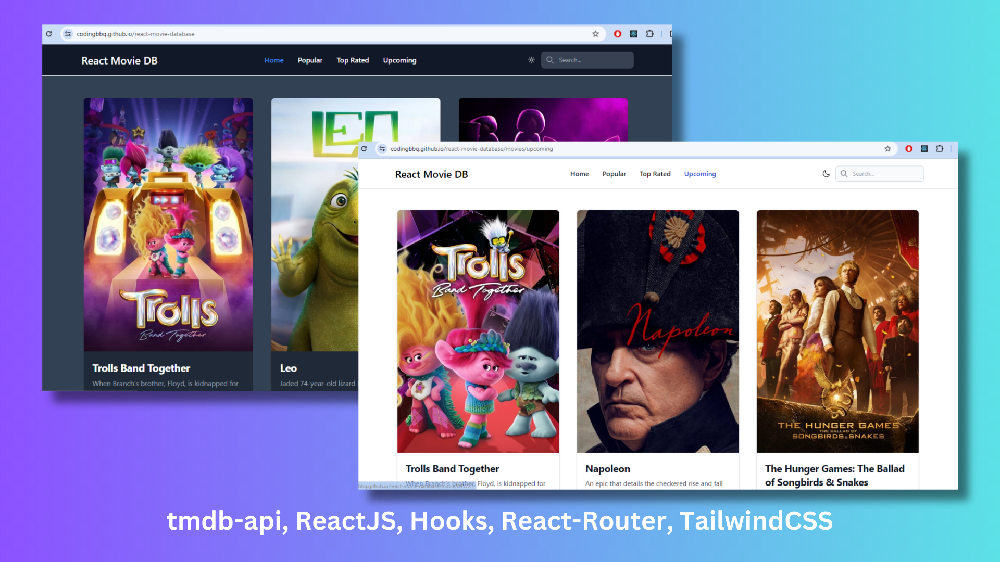

# React Movie Database

Check the project [React-Movie-Database](https://codingbbq.github.io/react-movie-database)

- ReactJS
- React Hooks such as useEffect, useState
- React Router
- TailwindCSS
- Flowbite for components using Tailwindcss
- gh-pages to host the application
- vite

## Note
- Had to update the BrowserRouter basename property to be able to correctly use the Routing on gh-pages
- Had to update the URL for .js and .css after the application is deployed to correctly point to the resources after the app is deployed
